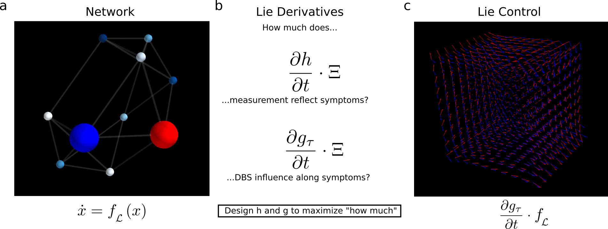
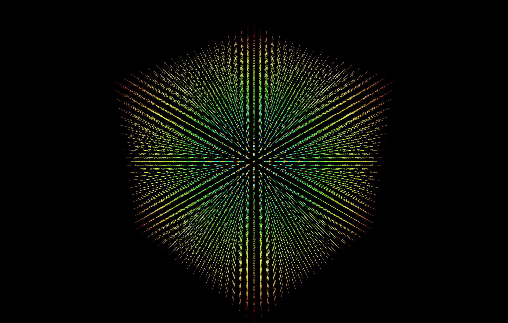
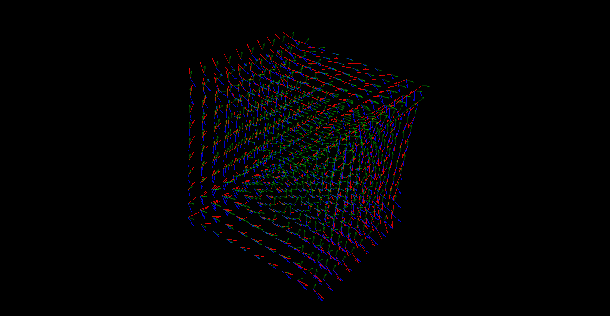

# autoLie
A library built on top of autograd that enables Lie derivatives and brackets on arbitrary numpy functions

Setting up a network of regions, each with its own dynamics, in order to do Lie-based analysis that can tell us the optimal readout and optimal control locations given a predefinec objective function.
For a more detailed mathematical treatment head on over to the [overview notebook]()

# Installation

Do the standard thing. Point yourselves towards the main file "lie_lib.py" and add it to your path. From there, import the primary classes and methods

> from lie_lib import *

> from dyn_lib import *

lie_lib is the main library for lie analyses.
dyn_lib is the main library for various dynamics functions

## Required Libraries
We use autograd, numpy, and mayavi to have the whole package running.

## Jump into hands-on
Run interact_lie.py to start seeing how vector fields interact with each other.
This script builds off of the autoLie library with an interactive GUI frontend to tweak with certain parameters and observe the effects on a dynamics field immediately.

## Example
Below is a simple example using two vector-valued functions $f$ and $g$

The vector fields are seen as quivers and the lie-derivative calculated at each point of the meshgrid is seen as spheres/point3d dots.

Another example, this one with the rotational components of a dynamics field a little more apparent

Check out example notebook [here]()

## Dynamics
Dynaics is the study of change.
Imagine standing somewhere in the city you live.
Where are you going to be in one minute?

Well, it depends.
Where are you going?
What's the quickest way to get there?
What vehicle are you in?

Diving into dynamics can be difficult.
Different types of dynamics can be visualized in different ways.
We'll stick with 3d dynamics and start with a simple field

Moving to something a bit more complicated, we'll focus on a field with rotational dynamics

