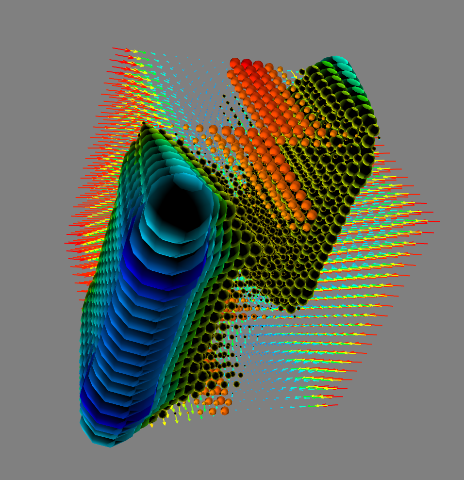
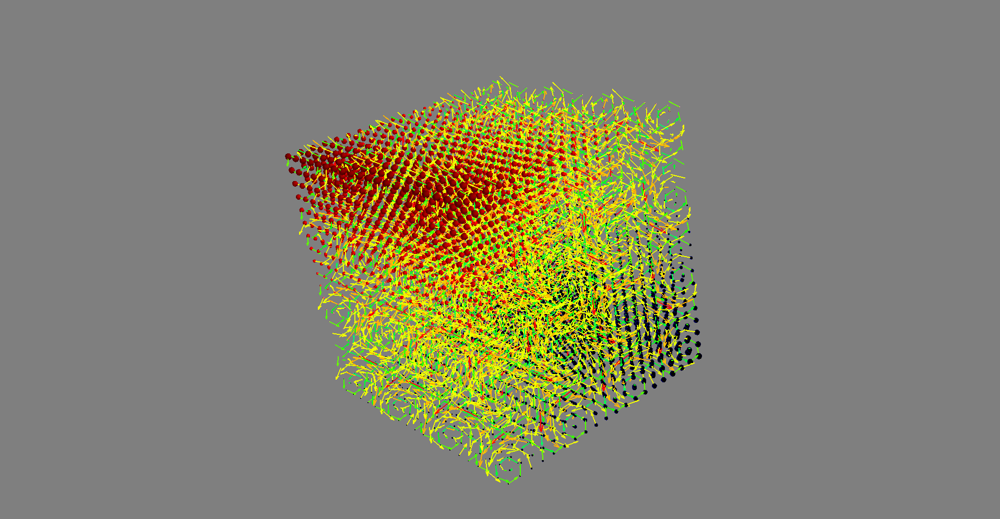

# autoLie

A simple library for doing Lie derivatives and brackets using autograd-compatible functions

## Installation

Do the standard thing. Point yourselves towards the main file "lie_lib.py"

## Required Libraries
We use autograd, numpy, and mayavi to have the whole package running.

## Jump into hands-on
Run interact_lie.py to start seeing how vector fields interact with each other.
This script builds off of the autoLie library with an interactive GUI frontend to tweak with certain parameters and observe the effects on a dynamics field immediately.

## Example
Below is a simple example using two vector-valued functions $f$ and $g$

The vector fields are seen as quivers and the lie-derivative calculated at each point of the meshgrid is seen as spheres/point3d dots.

Another example, this one with the rotational components of a dynamics field a little more apparent

Check out example notebook [here]()
