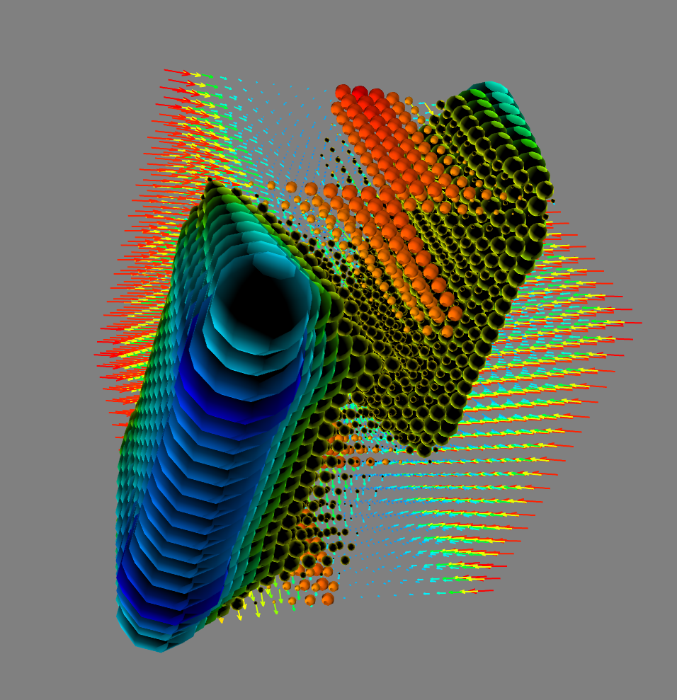

# PyLie

A simple library for doing Lie derivatives and brackets using autograd-compatible functions

## Installation

Do the standard thing. Point yourselves towards the main file "lie_lib.py"

## Example
Check out the example notebook

